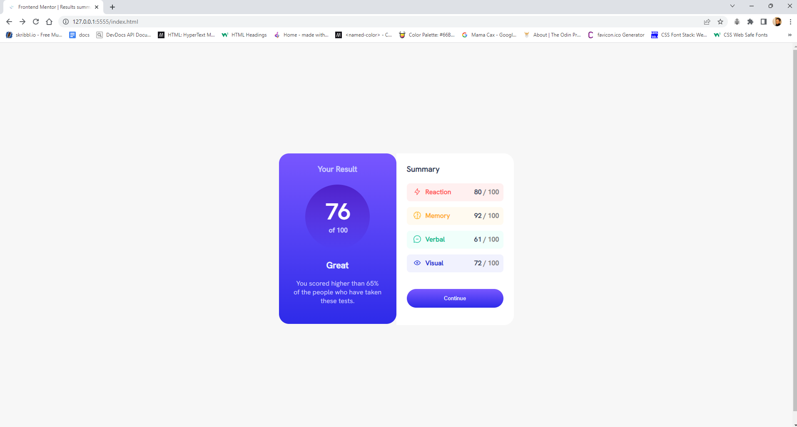

# Frontend Mentor - Results summary component solution

This is a solution to the [Results summary component challenge on Frontend Mentor](https://www.frontendmentor.io/challenges/results-summary-component-CE_K6s0maV). Frontend Mentor challenges help you improve your coding skills by building realistic projects.

## Table of contents

- [Overview](#overview)
  - [The challenge](#the-challenge)
  - [Screenshot](#screenshot)
  - [Links](#links)
- [My process](#my-process)
  - [Built with](#built-with)
  - [What I learned](#what-i-learned)
  - [Continued development](#continued-development)
- [Author](#author)
- [Acknowledgments](#acknowledgments)

## Overview

### The challenge

Users should be able to:

- View the optimal layout for the interface depending on their device's screen size
- See hover and focus states for all interactive elements on the page

### Screenshot



### Links

- Solution URL: [https://github.com/CNash23/results-comp/blob/main/index.html)](https://your-solution-url.com)
- Live Site URL: [ https://cnash23.github.io/results-comp/](https://your-live-site-url.com)

## My process

I made my sections, gave them a color and positioned them. Then added the content within each one. After doing this, I added styling and more detailed positioning of the contents within each section.

### Built with

- HTML
- - CSS Grid

### What I learned

I learned about the background-image linear gradient style attribute which makes blended colors. Fun!
I also learned more about using spans to isolate elements for precise positioning.

```css
.proud-of-this-css {
  background-image: linear-gradient(
    hsla(256, 72%, 46%, 1),
    hsla(241, 72%, 46%, 0)
  );
}
```


### Continued development

I will continue to focus on learning more advanced HTML and CSS.


## Author

- Website -Clea Carty(https://www.linkedin.com/in/clea-carty-50930a26/)
- Frontend Mentor - @CNash23(https://www.frontendmentor.io/profile/CNash23)

## Acknowledgments

Special thanks to Frank Chambergo of Fullstack Academy for helping me with the postioning of some elements.
